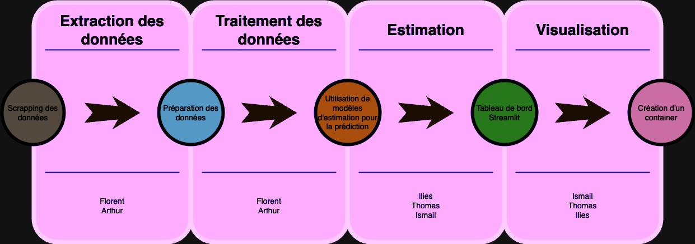

# Présentation du Projet

Le projet est un outil d'analyse et de prévision complet pour les cours de l'action Tesla. Il est structuré en trois parties principales, chacune contribuant à l'objectif global de comprendre et de prédire le comportement des actions.

## 1. Extraction de Données

Dans le dossier `Processing`, vous trouverez la première étape du projet, qui consiste à extraire des données essentielles de différentes sources :

### a. Données Financières
- **Objectif :** Obtenir des données financières relatives aux actions de Tesla, au S&P 500 et au NASDAQ 100.
- **Plage de Dates :** Du 01/01/2021 au 29/12/2022.
- **Implémentation :** Utilise des techniques de web scraping pour collecter des informations financières cruciales.

### b. Données Twitter
- **Objectif :** Rassembler des données liées aux tweets mentionnant Twitter ou Elon Musk.
- **Implémentation :** Récupère des tweets pertinents sur Twitter, fournissant des informations sur le sentiment des médias sociaux entourant Tesla.

### c. Données de Décès en Voiture Tesla
- **Objectif :** Collecter des données sur les décès confirmés dans les voitures Tesla.
- **Implémentation :** Extrait des informations sur les décès dans les véhicules Tesla, contribuant à une vision holistique de l'impact de l'entreprise.

## 2. Traitement des Données

Après la collecte de divers ensembles de données, le projet passe à l'étape de `Traitement des Données`, où les informations sont consolidées et structurées pour une analyse ultérieure :

### DataTesla.csv
- **Objectif :** Un fichier CSV unifié regroupant toutes les données traitées.
- **Contenu :** Données financières, Twitter et décès en voiture Tesla fusionnées pour une analyse complète.

## 3. Estimation

À cette étape, le projet utilise divers modèles d'estimation pour comprendre et prédire les cours des actions de Tesla.

### Classe ModelFitter
Une classe Python dédiée, `ModelFitter`, a été créée pour faciliter le test de plusieurs modèles prédictifs. La classe inclut plusieurs modèles tels que OLS, RandomForest, PC Regression, Lasso et XGBoost.

## 4. Visualisation

Le fichier `dashboard_app.py` se concentre sur la création de représentations visuelles informatives des données :

### Tableau de Bord Streamlit
- **Objectif :** Fournir des visualisations claires pour améliorer la compréhension.
- **Implémentation :** Utilise Streamlit pour créer et déployer un tableau de bord avec deux pages :
    - **Page de Visualisation des Données :** Permet aux utilisateurs de sélectionner diverses métriques et de les visualiser.
    - **Page des Résultats de l'Estimation :** Affiche les résultats de l'estimation à l'aide des modèles définis dans la classe `ModelFitter`.

## Comment Utiliser

1. **Extraction de Données :**
   - Accédez au dossier `Processing`.
   - Exécutez les scripts pertinents pour l'extraction des données financières, des données Twitter et des données de décès en voiture Tesla.

2. **Traitement des Données :**
   - Ouvrez le dossier `Processing`.
   - Exécutez le script de consolidation des données (`ConsolidateData.py` ou similaire).
   - Localisez le fichier résultant `DataTesla.csv`.

3. **Estimation :**
   - Accédez à la section `Estimation`.
   - Exécutez les modèles et algorithmes d'estimation (fournissez des instructions spécifiques si nécessaire).

4. **Visualisation :**
   - Explorez le répertoire `Visualization`.
   - Exécutez les scripts ou notebooks de visualisation pour générer des graphiques et des diagrammes.

